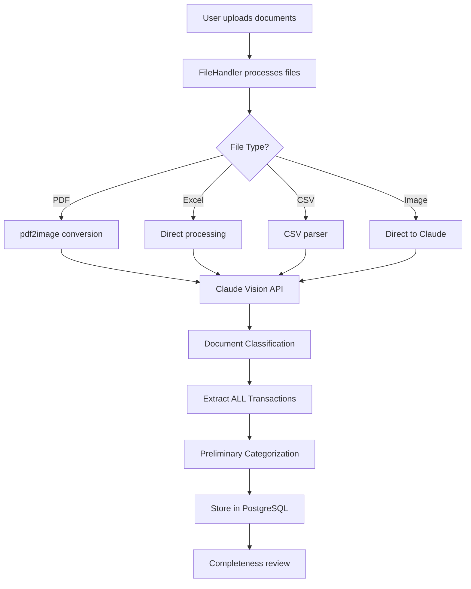
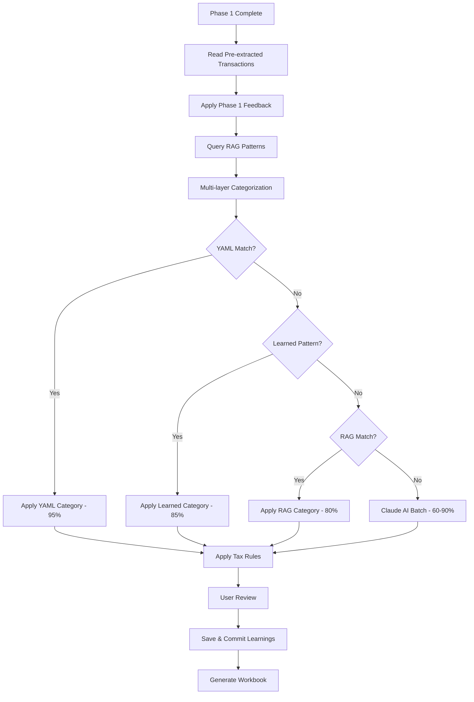

# Property Tax Agent - Complete System Architecture

## Table of Contents
1. [System Overview](#system-overview)
2. [Two-Phase Architecture](#two-phase-architecture)
3. [Technology Stack](#technology-stack)
4. [Phase 1: Document Intake & Classification](#phase-1-document-intake--classification)
5. [Phase 2: Transaction Processing & Learning](#phase-2-transaction-processing--learning)
6. [RAG Implementation](#rag-implementation)
7. [Database Architecture](#database-architecture)
8. [Key Services & Components](#key-services--components)

## System Overview

The Property Tax Agent is an AI-powered FastAPI application that automates the processing of New Zealand rental property tax returns (IR3R). It uses Claude AI Vision for document classification, extraction, and transaction categorization, with a sophisticated RAG-based learning system.

```
┌─────────────────────────────────────────────────────────────┐
│                        Web Interface                         │
│                    (Jinja2 Templates + Alpine.js)           │
└─────────────────┬───────────────────────────┬───────────────┘
                  │                           │
┌─────────────────▼───────────────────────────▼───────────────┐
│                        FastAPI Application                   │
│                          (Port 8000)                         │
└─────────────────┬───────────────────────────┬───────────────┘
                  │                           │
┌─────────────────▼───────────────────────────▼───────────────┐
│              Service Layer                  │   External     │
│  ┌──────────────────────────────────────┐  │   Services     │
│  │ • Document Processor (Phase 1)      │  │ ┌────────────┐ │
│  │ • Transaction Processor (Phase 2)   │  │ │ Claude AI  │ │
│  │ • Knowledge Store (RAG)             │  │ └────────────┘ │
│  │ • Workbook Generator                │  │ ┌────────────┐ │
│  │ • Tax Rules Service                 │  │ │  OpenAI    │ │
│  └──────────────────────────────────────┘  │ │ Embeddings │ │
│                                             │ └────────────┘ │
│                                             │ ┌────────────┐ │
│                                             │ │  Pinecone  │ │
│                                             │ │ Vector DB  │ │
│                                             │ └────────────┘ │
└─────────────────┬───────────────────────────┴───────────────┘
                  │
┌─────────────────▼───────────────────────────────────────────┐
│                    PostgreSQL Database                       │
│                     (Async SQLAlchemy)                       │
└──────────────────────────────────────────────────────────────┘
```

## Two-Phase Architecture

The system operates in two main phases with an integrated RAG learning system:

```
        PHASE 1                                    PHASE 2
Document Intake & Classification    Transaction Processing & Learning
┌────────────────────────────┐     ┌────────────────────────────┐
│                            │     │                            │
│  Upload Documents          │     │  Read Pre-extracted        │
│         │                  │     │  Transactions              │
│         ▼                  │     │         │                  │
│  Claude Vision             │     │         ▼                  │
│  Classification            │     │  Apply Phase 1 Feedback    │
│         │                  │     │         │                  │
│         ▼                  │     │         ▼                  │
│  Extract ALL Transactions  │────>│  Query RAG Patterns        │
│  (Financial Documents)     │     │         │                  │
│         │                  │     │         ▼                  │
│         ▼                  │     │  Multi-layer               │
│  Store in Database         │     │  Categorization            │
│         │                  │     │  (YAML→Learned→RAG→Claude) │
│         ▼                  │     │         │                  │
│  User Reviews Documents    │     │         ▼                  │
│  Submits Feedback          │────>│  User Reviews Transactions │
│                            │     │         │                  │
└────────────────────────────┘     │         ▼                  │
                                   │  Save & Commit Learnings   │
                                   │  (to Pinecone RAG)         │
                                   │         │                  │
                                   │         ▼                  │
                                   │  Generate Workbook         │
                                   │                            │
                                   └────────────────────────────┘
```

### Data Flow Optimization

The system is optimized to minimize Claude API calls:

1. **Phase 1 extracts ALL transactions** during document classification
2. **Phase 2 reads pre-extracted data** from the database
3. **Feedback flows from Phase 1 to Phase 2** for improved categorization
4. **RAG patterns are queried** before falling back to Claude AI

## Technology Stack

### Core Framework
- **FastAPI**: Async web framework
- **Uvicorn**: ASGI server with hot reload
- **Python 3.12+**: Latest Python version

### Frontend
- **Jinja2**: Server-side templating
- **Alpine.js**: Lightweight reactive framework
- **Tailwind CSS**: Utility-first CSS framework

### Database
- **PostgreSQL**: Primary database
- **SQLAlchemy 2.0**: Async ORM
- **Alembic**: Database migrations
- **asyncpg**: PostgreSQL async driver

### AI/ML Services
- **Claude AI (Anthropic)**:
  - Model: claude-opus-4-5-20251101
  - Vision API for document processing
  - Text API for categorization
- **OpenAI**:
  - text-embedding-3-small for embeddings (1536 dimensions)
- **Pinecone**: Vector database for RAG

### Document Processing
- **pdf2image**: PDF to image conversion
- **Poppler**: PDF rendering backend
- **Pillow**: Image processing
- **openpyxl**: Excel file handling
- **python-multipart**: File upload handling

## Phase 1: Document Intake & Classification

### Process Flow



### Key Components

1. **Document Processor** (`app/services/phase1_document_intake/document_processor.py`)
   - Orchestrates document workflow
   - Saves files, classifies via Claude, stores results

2. **Claude Client** (`app/services/phase1_document_intake/claude_client.py`)
   - Handles retry logic with exponential backoff
   - Manages vision API for scanned documents
   - Parses JSON responses

3. **Prompts** (`app/services/phase1_document_intake/prompts.py`)
   - `DOCUMENT_CLASSIFICATION_PROMPT`: Document type detection
   - `TRANSACTION_EXTRACTION_AND_FLAGGING_RULES`: Full transaction extraction

### Transaction Extraction in Phase 1

Financial documents (bank statements, loan statements, PM statements) have ALL transactions extracted:

```python
{
  "transactions": [
    {
      "date": "2024-01-15",
      "description": "LOAN INTEREST CHARGED",
      "amount": -523.45,
      "other_party": "ANZ Bank",
      "suggested_category": "interest",
      "confidence": 0.95,
      "needs_review": false,
      "review_reasons": []
    }
  ],
  "transaction_summary": {
    "total_count": 45,
    "flagged_count": 5,
    "total_income": 15600.00,
    "total_expenses": -8234.50
  }
}
```

## Phase 2: Transaction Processing & Learning

### Process Flow



### Multi-layer Categorization

```
Transaction Input
        │
        ▼
┌───────────────────┐
│ 1. YAML Patterns  │ ─── High confidence (95%) if matched
│    (categorization.yaml)
└────────┬──────────┘
         │ No match
         ▼
┌───────────────────┐
│ 2. Learned        │ ─── From user corrections (80-90%)
│    Patterns       │     (TransactionPattern table)
└────────┬──────────┘
         │ No match
         ▼
┌───────────────────┐
│ 3. RAG Semantic   │ ─── Vector similarity search
│    Search         │     (Pinecone transaction-coding)
└────────┬──────────┘
         │ Low confidence
         ▼
┌───────────────────┐
│ 4. Claude AI      │ ─── Batch processing (60-90%)
│    Fallback       │     (20-25 transactions/batch)
└───────────────────┘
```

### Key Components

1. **Transaction Processor** (`app/services/transaction_processor.py`)
   - Reads pre-extracted transactions from Phase 1
   - Applies Phase 1 feedback
   - Queries RAG patterns
   - Falls back to Claude only if needed

2. **Transaction Categorizer** (`app/services/transaction_categorizer.py`)
   - Multi-layer categorization engine
   - YAML patterns, learned patterns, RAG, Claude

3. **RAG Integration** (`app/services/rag_categorization_integration.py`)
   - Bridge between categorizer and Pinecone
   - Semantic search for similar transactions

## RAG Implementation

### Architecture

```
┌─────────────────────────────────────────────────────────────┐
│                    Transaction Input                         │
└────────────────────┬────────────────────────────────────────┘
                     │
┌────────────────────▼────────────────────────────────────────┐
│                 Embedding Generation                         │
│                  (OpenAI text-embedding-3-small)            │
│                  (1536 dimensions)                           │
└────────────────────┬────────────────────────────────────────┘
                     │
┌────────────────────▼────────────────────────────────────────┐
│                   Vector Search                              │
│                    (Pinecone)                                │
└────────────────────┬────────────────────────────────────────┘
                     │
                ┌────▼─────┐
                │ Results? │
                └────┬─────┘
                     │
        ┌────────────┴────────────┐
        │                         │
    ┌───▼────┐              ┌────▼────┐
    │  Yes   │              │   No    │
    └───┬────┘              └────┬────┘
        │                        │
┌───────▼────────┐      ┌───────▼────────┐
│ Apply learned  │      │  Use Claude +   │
│  categorization│      │  Save embedding │
└────────────────┘      └─────────────────┘
```

### Pinecone Namespaces

| Namespace | Purpose | Used By |
|-----------|---------|---------|
| `transaction-coding` | Transaction categorization patterns | Phase 2 categorization |
| `skill_learnings` | General domain knowledge | Skill learning service |
| `document-review` | Document classification feedback | Phase 1 learning |

### Knowledge Store (`app/services/phase2_feedback_learning/knowledge_store.py`)

```python
class KnowledgeStore:
    async def search(
        self,
        query: str,
        top_k: int = 5,
        min_score: float = 0.7,
        namespace: str = None  # Supports multiple namespaces
    ) -> List[Dict]:
        # Generate embedding via OpenAI
        # Search Pinecone
        # Return relevant matches

    async def store(
        self,
        content: str,
        scenario: str,
        category: str,
        namespace: str = None
    ) -> Optional[str]:
        # Generate embedding
        # Store in Pinecone with metadata
```

### Save & Commit Learnings

When users review and correct transactions:

1. **Only manually reviewed transactions saved** (where `manually_reviewed = True`)
2. **Duplicate checking** via semantic search (0.95 threshold)
3. **Storage in Pinecone** with OpenAI embeddings

```python
# Duplicate check
existing = await knowledge_store.search(
    query=f"{description} {category_code}",
    top_k=5,
    min_score=0.95,  # High threshold for duplicates
    namespace="transaction-coding"
)
```

## Database Architecture

### Entity Relationships

```
Client (1) ─────> (*) TaxReturn
                         │
                         ├──> (*) Document
                         │        │
                         │        └──> extracted_data (JSON with transactions)
                         │
                         └──> (*) Transaction
                                  │
                                  ├──> (1) PLRowMapping
                                  │
                                  └──> (*) CategoryFeedback

TransactionPattern (*) <──── (*) CategoryFeedback
```

### Key Tables

| Table | Purpose |
|-------|---------|
| `clients` | Customer records |
| `tax_returns` | Tax return metadata, property info |
| `documents` | Uploaded files, classification, extracted_data (JSON) |
| `transactions` | Individual financial transactions |
| `pl_row_mappings` | Category to P&L row mapping with groups |
| `transaction_summaries` | Aggregated totals by category |
| `transaction_patterns` | Learned categorization patterns |
| `category_feedback` | User corrections audit trail |

### Transaction Table Key Fields

| Field | Description |
|-------|-------------|
| `category_code` | Category identifier |
| `transaction_type` | income/expense/excluded |
| `is_deductible` | Whether deductible for tax |
| `deductible_percentage` | 80% or 100% |
| `confidence` | Categorization confidence |
| `categorization_source` | yaml/learned/rag/claude |
| `manually_reviewed` | User has reviewed/changed |
| `needs_review` | Flagged for attention |

## Key Services & Components

### Phase 1 Services

| Service | Purpose | Key Methods |
|---------|---------|-------------|
| `DocumentProcessor` | Orchestrates intake | `process_documents()` |
| `ClaudeClient` | Claude API integration | `classify_document()`, `review_completeness()` |
| `FileHandler` | File processing | `save_files()`, `process_file()` |

### Phase 2 Services

| Service | Purpose | Key Methods |
|---------|---------|-------------|
| `TransactionProcessor` | Main orchestrator | `process_document()`, `_get_phase1_transactions()` |
| `TransactionCategorizer` | Multi-layer categorization | `categorize_transactions()` |
| `KnowledgeStore` | Pinecone RAG | `search()`, `store()` |
| `WorkbookGenerator` | Excel generation | `generate_workbook()` |
| `TaxRulesService` | Tax compliance | `get_interest_deductibility()` |

### Supporting Services

| Service | Purpose |
|---------|---------|
| `CategorizationTrace` | Audit trail for decisions |
| `RAGCategorizationIntegration` | RAG-categorizer bridge |
| `EmbeddingsService` | OpenAI embeddings |

## Directory Structure

```
app/
├── api/
│   ├── routes.py                    # Phase 1 document routes
│   ├── transaction_routes.py        # Phase 2 transaction routes
│   └── categorization_analytics.py  # Analytics endpoints
├── models/
│   └── db_models.py                 # SQLAlchemy models
├── schemas/
│   ├── documents.py                 # Document schemas
│   └── transactions.py              # Transaction schemas
├── services/
│   ├── phase1_document_intake/
│   │   ├── document_processor.py
│   │   ├── claude_client.py
│   │   ├── file_handler.py
│   │   └── prompts.py               # Full transaction extraction
│   ├── phase2_feedback_learning/
│   │   ├── knowledge_store.py       # Pinecone RAG
│   │   ├── embeddings.py            # OpenAI embeddings
│   │   └── skill_learning_service.py
│   ├── transaction_processor.py     # Phase 2 orchestrator
│   ├── transaction_categorizer.py   # Multi-layer categorization
│   ├── rag_categorization_integration.py
│   ├── categorization_trace.py
│   ├── tax_rules_service.py
│   └── workbook_generator.py
├── rules/
│   └── categorization.yaml          # YAML patterns
├── skills/
│   └── nz_rental_returns/           # Domain knowledge
├── templates/                       # Jinja2 templates
├── config.py
├── database.py
└── main.py
```

## Performance Optimizations

1. **No Double API Calls**: Phase 1 extracts transactions, Phase 2 reads from database
2. **Batch Categorization**: 20-25 transactions per Claude call
3. **RAG Caching**: Patterns stored in Pinecone for fast retrieval
4. **Embedding Cache**: Common descriptions cached
5. **Sequential Processing**: Avoids rate limits and race conditions
6. **SSE Deduplication**: Prevents duplicate processing when clients reconnect

## SSE Progress Tracking

The system uses Server-Sent Events (SSE) for real-time progress updates during transaction processing.

### Duplicate Processing Prevention

```python
# Check if processing is already in progress for this tax return
existing_tracker = get_tracker(task_id)
if existing_tracker and not existing_tracker.is_complete:
    # Return existing stream instead of starting new processing
    return StreamingResponse(existing_tracker.stream(), ...)
```

This prevents duplicate transactions when:
- Browser reconnects after network hiccup
- User refreshes page during processing
- Multiple tabs open same processing URL

### Progress Tracker Registry

| Function | Purpose |
|----------|---------|
| `create_tracker(task_id)` | Create new tracker, register in global dict |
| `get_tracker(task_id)` | Retrieve existing tracker by ID |
| `remove_tracker(task_id)` | Clean up after processing complete |

## Settlement Statement Conversion

Settlement statements are converted to transactions in document order with automatic calculations:

```python
settlement_line_items = [
    # (field_name, display_name, category, is_expense, related_field_for_calc)
    ("purchase_price", "Purchase Price", "capital_purchase", True, None),
    ("rates_apportionment", "Rates", "rates", True, "rates_instalment_paid_by_vendor"),
    ("water_rates_apportionment", "Water Rates", "water_rates", True, None),
    ("legal_fees", "Legal/Conveyancing Fees", "legal_fees", True, None),
    # ... more items
]
```

### Apportionment Calculation

For rates with both instalment and apportionment:
- **Deductible Amount** = Vendor's Instalment - Apportionment
- Raw values stored in `metadata` for audit trail

## Security Considerations

1. **File Upload Security**: Type validation, size limits
2. **API Security**: Rate limiting, API key management
3. **Data Privacy**: Encryption, PII handling, audit logging
4. **Environment Variables**: Secrets stored securely

## Future Enhancements

1. **Multi-tenancy**: Separate workspaces per accounting firm
2. **Real-time Collaboration**: WebSocket updates
3. **IRD Direct Integration**: Direct submission to tax authority
4. **Advanced Analytics**: Predictive tax optimization
5. **Mobile App**: Native mobile interfaces
